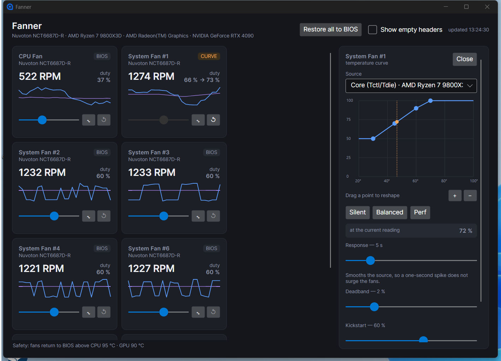
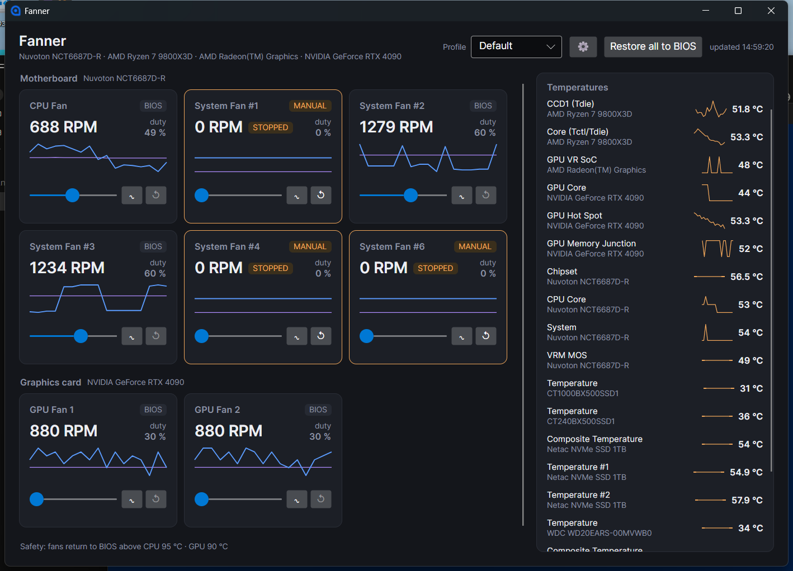
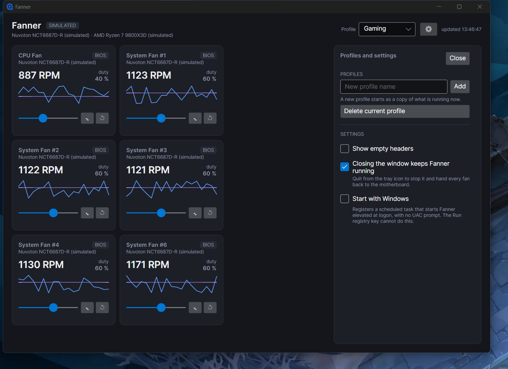

# Fanner

[English](README.md) · **Русский**

Приложение с графическим интерфейсом для управления вентиляторами материнской
платы. Windows, .NET 10, Avalonia.

Читает все разъёмы вентиляторов и температуры, управляет любым разъёмом вручную
или по температурной кривой, хранит именованные профили и умеет запускаться вместе
с Windows.



## Заработает ли на вашей плате?

На десктопной плате управление вентиляторами — не функция производителя, а
микросхема Super I/O. Fanner добирается до неё через
[LibreHardwareMonitor][lhm], который покрывает распространённые чипы Nuvoton и ITE.
Разрабатывалось на MSI X870 GAMING PLUS WIFI с **Nuvoton NCT6687D-R** — он стоит на
большей части текущей десктопной линейки MSI, так что поддержка получается широкой,
а не привязанной к одной модели. Другие поддерживаемые чипы должны работать, но не
проверялись; если Fanner не найдёт ни одного, он прямо скажет об этом при запуске.

Вентиляторы видеокарты достаются бесплатно — через API производителя.

С *ноутбуками* MSI всё иначе: там вендорский WMI и регистры EC, а не шина LPC.
Fanner их не поддерживает.

## Установка

**Установщика нет.** Fanner — один самодостаточный исполняемый файл: положите его
куда удобно и запустите. Рантайм .NET он несёт внутри, так что ставить его не нужно.
Но одного exe недостаточно — потребуется ещё две вещи.

### 1. Драйвер PawnIO

Чтение микросхемы Super I/O — это ввод-вывод в порты из нулевого кольца, чего
обычная программа сделать не может. Драйвер ставится один раз:

```powershell
winget install namazso.PawnIO
```

Либо возьмите `PawnIO_setup.exe` с [pawnio.eu][pawnio] и запустите с ключом
`-install`.

Без него ничего не падает и ничего не пишется в журнал — просто все чтения из
нулевого кольца возвращают ноль, и это выглядит ровно как неподдерживаемая плата.
Fanner проверяет наличие драйвера при запуске и сообщает об этом вместо того, чтобы
показать пустой список.

PawnIO подписан и совместим с Memory Integrity (HVCI), поэтому отключать что-либо из
защиты не требуется. Он пришёл на смену WinRing0, который объявлен устаревшим,
помечается Defender как вредоносный и входит в список уязвимых драйверов Microsoft —
на актуальной Windows 11 тот бы попросту не загрузился.

### 2. Права администратора

Fanner намеренно стартует без повышения прав: вы получаете окно с объяснением, чего
он не может, и кнопкой перезапуска с правами, а не запрос UAC до того, как хоть
что-то увидели.

### Затем скачайте

Возьмите `Fanner-<версия>-win-x64.exe` из
**[последнего релиза](https://github.com/f0rmat1k/Fanner/releases/latest)**.
Нужна Windows 10 или 11, x64.

Файл не подписан, поэтому Windows сообщит, что издатель неизвестен: нажмите
*Подробнее*, затем *Выполнить в любом случае*. Если предпочитаете проверить, а не
поверить, — рядом с exe в каждом релизе лежит `.sha256`:

```powershell
Get-FileHash .\Fanner-v0.3.0-win-x64.exe -Algorithm SHA256
```

## Сборка из исходников

Нужен [.NET 10 SDK][dotnet].

```powershell
dotnet run --project src/Fanner.App
```

Чтобы работать над интерфейсом без драйвера, без прав администратора и без риска для
вентиляторов:

```powershell
dotnet run --project src/Fanner.App -- --simulate
```

Симулятор повторяет настоящую плату вместе с её неудобствами: непоследовательные
индексы разъёмов, разъёмы, которые сообщают duty, но никогда не крутятся, и duty,
который не прыгает на заданное значение, а плавно к нему идёт.

```powershell
dotnet test
```

## Устройство

| Проект | |
|---|---|
| `Fanner.Core` | Модели, контракт `IHardwareBackend`, служба опроса, скользящая история, движок кривых, сторож, профили и сохранение настроек, симулятор. Не зависит ни от одной библиотеки работы с железом. |
| `Fanner.Hardware.Windows` | LibreHardwareMonitor под этим контрактом плюс определение PawnIO. |
| `Fanner.App` | Интерфейс на Avalonia, MVVM, иконка в трее и задача автозапуска. |
| `Fanner.Core.Tests` | То, что стоит зафиксировать: эвристика пустого разъёма, вычисление кривой, сглаживание, мёртвая зона и кикстарт, пороги сторожа, сохранение и миграция конфига, жизненный цикл монитора и гарантия возврата при выходе. |

Всё, что касается железа, выполняется на одном потоке, которым владеет
`MonitorService`. Запись ставится к нему в очередь, а не вызывается напрямую, чтобы
поток интерфейса никогда не входил в драйвер посреди опроса.

### Как читать карточку вентилятора



Карточки сгруппированы по железу, которое ими управляет. Видеокарта крутит свои
вентиляторы через API производителя, а корпусные и процессорный разъёмы все сидят
на микросхеме Super I/O платы — отдельного «контроллера процессорного вентилятора»
не существует, поэтому и группы под него нет.

Бейдж показывает, кто управляет разъёмом: **BIOS** — прошивка платы, **MANUAL** —
вы подвинули ползунок, **CURVE** — работает кривая. Кнопка `↺` возвращает прошивке
один вентилятор; **Restore all to BIOS** возвращает все сразу и появляется, как
только хоть один удерживается.

Разъёмы, которые прокачиваются, но не сообщают обороты, скрыты: почти наверняка
они пустые. На этой плате их десять, а подключено шесть. Разъём, который
**хоть раз** сообщил вращение, не скрывается уже никогда, как бы неподвижно он ни
выглядел сейчас: вентилятор между скоростями несколько секунд прокачивается, но
стоит, и по одному этому мгновению он неотличим от пустого разъёма. Вентилятор на
**0 % duty** тоже не скрывается — он остановлен, а не отсутствует, и прятать его
значило бы убрать с экрана вентилятор, который вы только что выключили. Разъём,
доведённый нами до полной остановки, помечается **STOPPED** и обводится рамкой:
это единственный исход перетаскивания ползунка, который может стоить железа.

### Почему цифра отстаёт от ползунка

Чип не прыгает на новое значение duty, а плавно идёт к нему — примерно **2 % в
секунду** на NCT6687D, так что переход с 60 % на 85 % занимает около четырнадцати
секунд. Пока идёт переход, карточка показывает `69 % → 96 %`: что вентилятор делает
сейчас и куда направляется. Ничего не зависло.

### Кривые

Кнопка `∿` на карточке привязывает вентилятор к источнику температуры и сразу
начинает им управлять. Точки тянутся мышью; пунктирный маркер показывает, где
источник читает прямо сейчас, — благодаря ему форма кривой что-то означает уже в
момент рисования. Три заготовки — отправная точка, а не ограничение.

Кривая — это больше, чем таблица подстановки, потому что наивную версию ломают три
вещи:

- **Сглаживание** усредняет источник. Температура процессора меняется на десять
  градусов за секунду, когда просыпается ядро, и кривая, которая за ней гонится,
  заставляет вентиляторы постоянно взвывать и оседать — это раздражает куда сильнее,
  чем стабильно чуть завышенные обороты.
- **Мёртвая зона** — наименьшее изменение, которое стоит записывать. Без неё duty
  дёргается на доли процента каждую секунду бесконечно, и вентилятор никогда не
  устаканивается.
- **Кикстарт** раскручивает остановленный вентилятор. Большинство вентиляторов не
  стартуют с места на том duty, который потом их крутит, поэтому кривая, просящая
  15 % у остановленного вентилятора, оставит его стоять — и выглядеть это будет
  пугающе похоже на сдохший вентилятор. Короткий импульс решает проблему.
  Ограничен тремя попытками: пустой разъём не покажет обороты, сколько его ни качай.

Источники названы в формате `канал · железо`, потому что несколько накопителей
сообщают канал с именем просто «Temperature», и по одному имени их не различить.

### Профили



Профиль — именованный набор настроек вентиляторов: кривые и фиксированные значения
duty вместе, потому что реальная конфигурация их смешивает — кривая на процессорном
вентиляторе, помпа закреплена на 100 %, остальное отдано прошивке. Профили
переключаются в шапке окна или через иконку в трее.

Активный профиль всегда отражает то, что работает сейчас: каждое изменение пишется
прямо в него, поэтому понятия «несохранённых изменений» не существует. Новый профиль
создаётся копией текущего состояния — обычно именно это и нужно после того, как всё
настроено.

Переключение **отпускает вентиляторы, которых нет в новом профиле**. Без этого
переход с профиля, где вентилятор был закреплён, на профиль без него оставил бы его
висеть на старом значении — молча унаследованная настройка от профиля, с которого вы
только что ушли.

Всё хранится в `%APPDATA%\Fanner\config.json` и применяется при следующем запуске.
Записи, ссылающиеся на отсутствующее железо, отбрасываются, а не сохраняются, — чтобы
вентилятор не выглядел настроенным, когда им никто не управляет.

### Трей и автозапуск

Закрытие окна прячет Fanner в трей, а не завершает его: контроллер вентиляторов,
который перестаёт управлять вентиляторами при закрытии окна, — редко то, что
подразумевают под закрытием окна. Пункт **Quit Fanner** в меню трея останавливает
программу по-настоящему, вернув все вентиляторы прошивке. Если вы не согласны, это
поведение отключается в настройках.

**Start with Windows** создаёт задачу в планировщике, а не запись в ключе `Run`
реестра. Реестровый ключ — очевидный и неверный выбор: он запускает без повышения
прав, и Fanner каждый раз при входе показывал бы «нужны права администратора» и ничем
не управлял. Задача с уровнем `HighestAvailable` стартует с правами и не вызывает
запрос UAC. Она запускает Fanner скрытым, чтобы вход в систему не выбрасывал окно вам
в лицо.

### Сторож

Пока хоть один вентилятор удерживается, Fanner следит за температурами и возвращает
прошивке **всё сразу**, если какая-то пересечёт предел: 95 °C для процессора, 90 °C
для видеокарты. Пределы намеренно высокие: 9800X3D под нагрузкой штатно сидит в
районе девяноста с небольшим, а предупреждение, срабатывающее в обычной игре, — это
предупреждение, которое учатся игнорировать.

Вернуть управление лучше, чем выкрутить на 100 %: заводская кривая платы — заведомо
исправная конфигурация, а под сомнением в этот момент именно то значение, которое
выбрали мы.

Срабатывание также **ставит кривые на паузу**. Отпустить вентиляторы, не остановив
движок, было бы театром: следующий же цикл опроса вычислил бы кривую и забрал их
обратно. Возобновление — отдельная осознанная кнопка: признать, что чип перегрелся,
не должно молча перезапускать то, что к этому привело.

**Restore all to BIOS** ставит на паузу, а не удаляет. Аварийную кнопку, которая
втихую сносит настройки, не нажимают тогда, когда она нужна.

Вентиляторы никогда не остаются закреплёнными на программном значении duty: монитор
возвращает каждый разъём прошивке при выходе, причём освобождение выполняется на
железном потоке ещё до того, как о нём узнает интерфейс, — зависшее окно не может его
задержать. Единственный случай, который это не покрывает, — принудительное убийство
процесса: `TerminateProcess` не переживает ни одна программа в пользовательском
режиме. Впрочем, при следующей перезагрузке управление в любом случае возвращается
прошивке.

## Лицензия

Fanner распространяется под лицензией MIT — см. [LICENSE](LICENSE).

`Fanner.Hardware.Windows` линкует [LibreHardwareMonitorLib][lhm] под MPL-2.0.
MPL — пофайловый копилефт: он распространяется на файлы самой библиотеки, а не на
использующий её код, поэтому остальной репозиторий остаётся под MIT.

[lhm]: https://github.com/LibreHardwareMonitor/LibreHardwareMonitor
[pawnio]: https://pawnio.eu/
[dotnet]: https://dotnet.microsoft.com/download/dotnet/10.0
